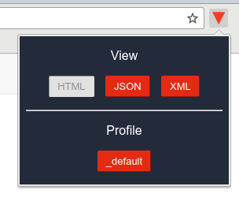

# Funnelback Front-End Tools Chrome Extension

This extension provides a few tools to help with Funnelback front-end development:

* Switch views between HTML, JSON and XML
* Switch between the live and preview profiles, and reset the profile to the `_default` one.

Install from the [Chrome Web Store](https://chrome.google.com/webstore/detail/funnelback-front-end-tool/dpjjibbiopfihcjkpfkjmpgalpidbbaj)
